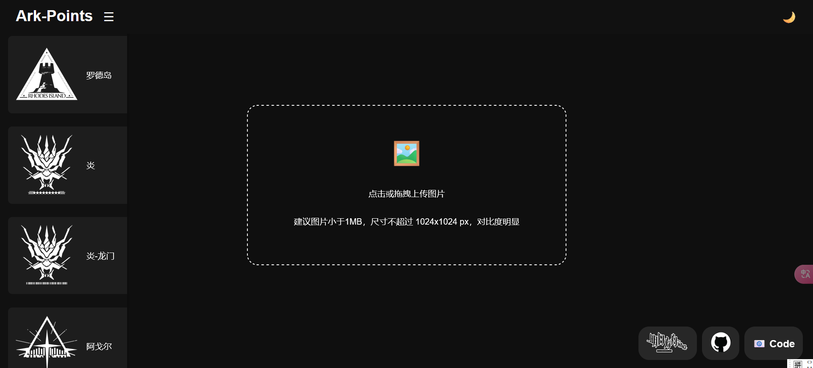
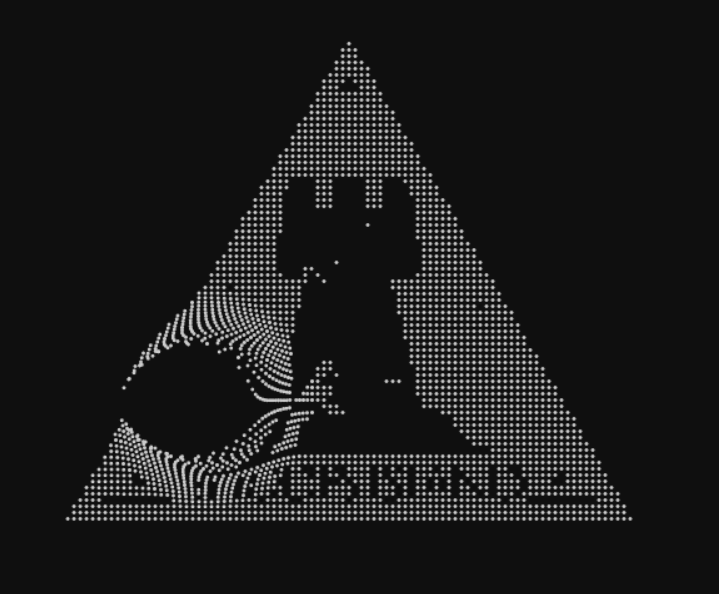
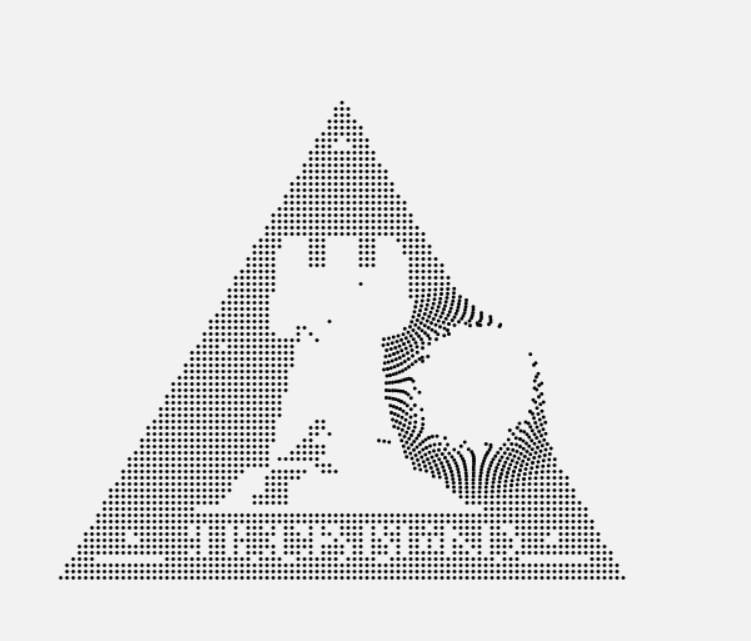
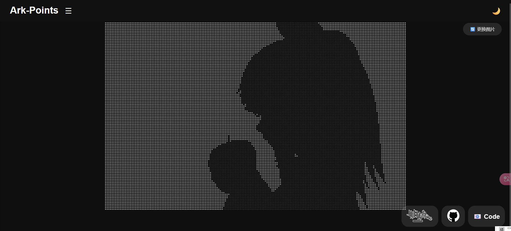

# ArkPoints 🚀

**🌌 明日方舟同款粒子特效复刻版**  
上传图片即可生成可交互粒子系统，基本还原官网粒子特效！✨

  <!-- 图片1 -->
  

    
开始界面

    
  

  <!-- 图片2 -->
  

    
黑夜模式

    
    
  

  <!-- 图片3 -->
  

    
白天模式

    
  

  <!-- 自定义图片演示 -->
  

    
自定义图片效果

    
  

## ✨ 炫酷功能

| 🎮 互动体验       | 🎨 视觉特效       | ⚙️ 实用功能      |
|------------------ |------------------ |------------------|
| 智能粒子牵引系统   | 昼夜主题一键切换   | 30+预设阵营图库   |
| 多触点手势支持     | 物理引擎模拟       | 自动图像优化      |
| 粒子光效渲染       | 流畅动画过渡       | 移动端适配        |

## 碎碎念

深深感谢 DeepSeek 
作者在制作过程中抽出了新春限定，可喜可贺

## 🚀 点击进入我的网站

前往 https://www.arkpoints.top（域名申请ing）

