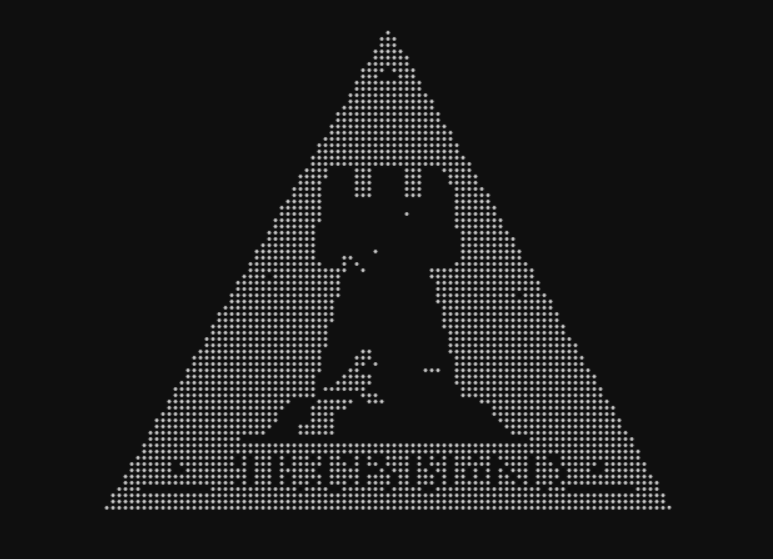
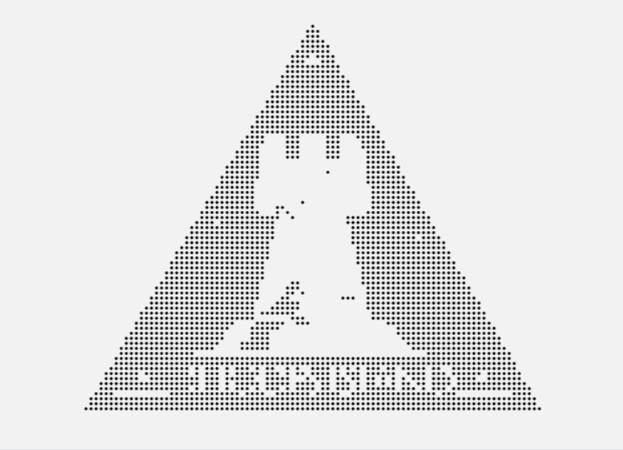

# ArkPoints 🚀

[](https://ak.hypergryph.com/#world)
[](https://wiki.biligame.com/arknights/?curid=1)

**🌌 明日方舟同款粒子特效复刻版**  
上传图片即可生成可交互粒子系统，基本还原官网粒子特效！✨

<div style="text-align: center;">
  <div style="margin: 30px 0;">
    <p style="margin: 5px 0;">开始界面</p>
    
  </div>

  <div style="margin: 30px 0;">
    <p style="margin: 5px 0;">黑夜模式</p>
    
    
  </div>

  <div style="margin: 30px 0;">
    <p style="margin: 5px 0;">白天模式</p>
    
  </div>

  <div style="margin: 30px 0;">
    <p style="margin: 5px 0;">自定义图片效果</p>
    
  </div>
</div>

## ✨ 炫酷功能

| 🎮 互动体验       | 🎨 视觉特效       | ⚙️ 实用功能      |
|------------------ |------------------ |------------------|
| 智能粒子牵引系统   | 昼夜主题一键切换   | 30+预设阵营图库   |
| 多触点手势支持     | 物理引擎模拟       | 自动图像优化      |
| 粒子光效渲染       | 流畅动画过渡       | 移动端适配        |


## 核心参数配置
```javascript
/**
 * 粒子系统核心配置项
 * 路径: /js/index.js
 * 注意: 修改后需重新加载页面生效
 */
const CONFIG = {
    // 视觉参数
    particleSize: 3,        // 粒子直径（px）
    particleMargin: 1,      // 粒子初始间距（px）  
    
    // 物理参数
    repulsionRadius: 105,   // 斥力作用半径（px）
    repulsionForce: 1.8,    // 斥力强度 [0.1-5.0]
    friction: 0.15,         // 运动阻尼 [0.01-0.3]
    returnSpeed: 0.01,      // 位置回归速度 [0.001-0.1]
    
    // 图像处理
    samplingStep: 5,        // 采样步长（px）
    maxDisplayRatio: 0.8,   // 画布最大占比 [0.5-1.0]
    
    // 性能参数
    asyncBatchSize: 200,    // 异步批处理量
    maxImageSize: 1024,     // 输入图像尺寸限制
    
    // 移动端参数（自动覆盖主配置）
    mobile: {               
        repulsionRadius: 78,   // 缩小作用半径
        repulsionForce: 1.9,   // 增强触控响应
        friction: 0.16         // 增加运动阻尼
    }
};
```

## 参数详解

### 基础参数
| 分类 | 参数 | 类型 | 默认值 | 有效范围 | 说明 |
|------|------|------|-------|---------|-----|
| **视觉** | `particleSize` | number | 3 | 1-10 | 粒子绘制尺寸 |
|  | `particleMargin` | number | 1 | 0-5 | 粒子初始间距 |
| **物理** | `repulsionRadius` | number | 105 | 50-300 | 斥力作用范围 |
|  | `repulsionForce` | number | 1.8 | 0.1-5.0 | 斥力强度系数 |
|  | `friction` | number | 0.15 | 0.01-0.3 | 运动能量衰减率 |
|  | `returnSpeed` | number | 0.01 | 0.001-0.1 | 位置恢复速度 |

### 高级参数
| 分类 | 参数 | 类型 | 默认值 | 说明 |
|------|------|------|-------|-----|
| **图像** | `samplingStep` | number | 5 | 值越大粒子密度越低 |
|  | `maxDisplayRatio` | number | 0.8 | 画布占视口比例 |
| **性能** | `asyncBatchSize` | number | 200 | 推荐值100-500 |
|  | `maxImageSize` | number | 1024 | 防止内存溢出 |


### 公式参考
   - 粒子数量 ≈ `(图像宽度 ÷ 采样步长) × (图像高度 ÷ 采样步长)`
   - 斥力计算公式：`[(排斥半径 - 粒子距离) ÷ 排斥半径]² × 斥力强度`

### 参数调试：

   - 增大 repulsionForce → 整体斥力增强

   - 减小 repulsionRadius → 斥力作用范围缩小

   - 修改平方为线性（ratio * repulsionForce）→ 衰减更平缓


## 碎碎念

深深感谢 DeepSeek<br>
作者在制作过程中抽出了新春限定，可喜可贺

## 彩蛋
在画布上输入她的名字，中英文大小写皆可<br>
提示：她是刀客塔们第一眼见到的人

## 🚀 点击进入我的网站

前往 https://arkpoints.top

